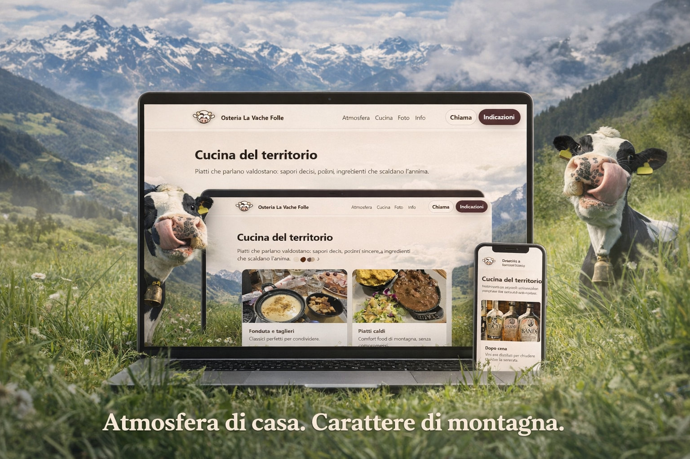
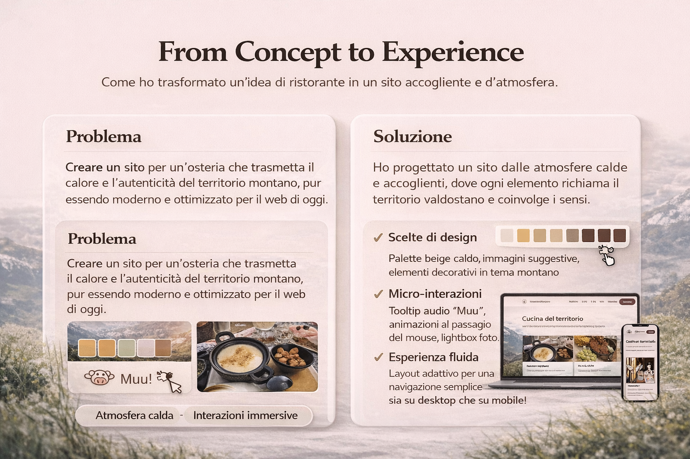
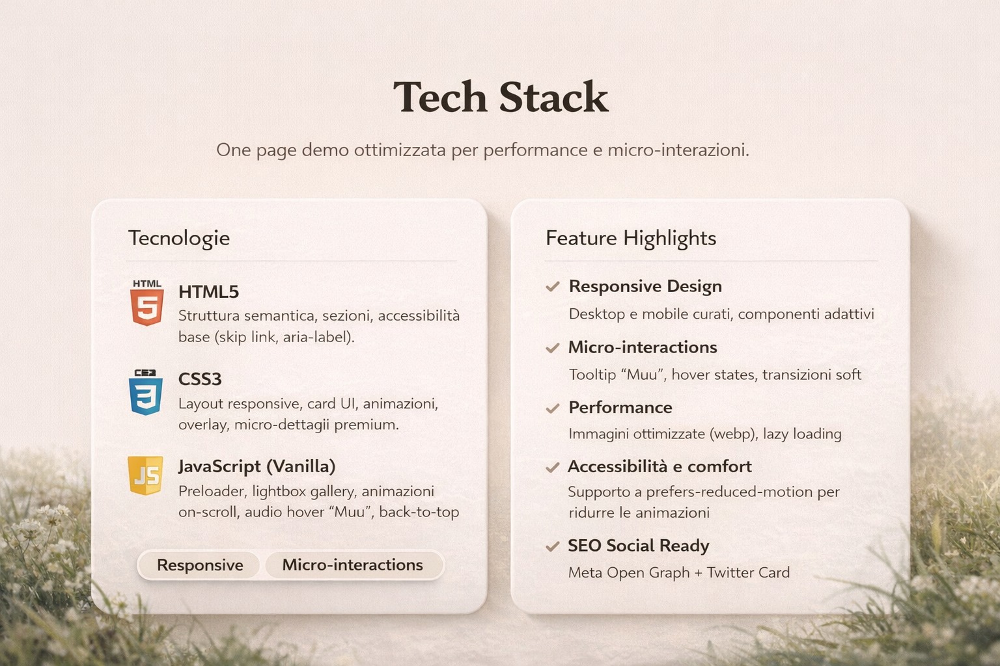

#🐄 Osteria La Vache Folle – One Page Experience

##📌 Project Overview

“Osteria La Vache Folle” è una one-page demo progettata per trasformare l’identità di un ristorante di montagna in un’esperienza digitale immersiva, moderna e responsive.

L’obiettivo era creare un sito capace di trasmettere:

Atmosfera calda e autentica

Carattere territoriale

Navigazione semplice e intuitiva

Cura dei micro-dettagli

Il progetto unisce estetica alpina e funzionalità web moderna.

##🎯 Concept

Creare un sito per un’osteria che trasmetta il calore e l’autenticità del territorio montano, pur essendo moderno e ottimizzato per il web di oggi.

La soluzione è stata progettare un’interfaccia:

Dalle palette beige e naturali

Con immagini immersive

Arricchita da micro-interazioni leggere

Ottimizzata per desktop e mobile

##🖥️ Preview
Desktop & Mobile Mockup

Atmosfera di casa. Carattere di montagna.

##🧱 Tech Stack

HTML5

Struttura semantica, sezioni chiare, accessibilità base (skip link, aria-label).

CSS3

Layout responsive con Flexbox e Grid, card UI, animazioni soft, overlay e micro-dettagli premium.

JavaScript (Vanilla)

Preloader

Lightbox gallery

Animazioni on-scroll

Audio hover “Muu”

Back-to-top button

##✨ Feature Highlights

✔ Responsive Design
Layout adattivo per desktop e mobile.

✔ Micro-interactions
Tooltip audio “Muu”, hover states, transizioni morbide.

✔ Performance
Immagini ottimizzate (WebP), lazy loading.

✔ Accessibilità
Supporto a prefers-reduced-motion per ridurre le animazioni.

✔ SEO Ready
Meta Open Graph (OG) + Twitter Card.

📈 Impact & Outcome

Il sito è stato progettato per offrire:

Navigazione chiara e intuitiva

Esperienza immersiva coerente col brand

Layout scalabile

Struttura pronta per future estensioni (menu online, prenotazioni, ecc.)

##🚀 Why This Project Matters

Questo progetto dimostra:

Cura del dettaglio UI

Pensiero progettuale (non solo codice)

Attenzione all’esperienza utente

Integrazione tra design e performance

Non è solo una demo grafica.
È un case study di trasformazione digitale.
